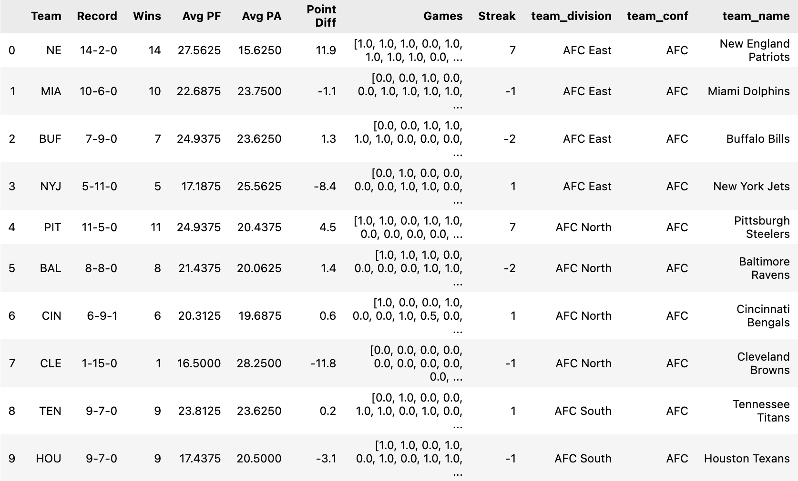
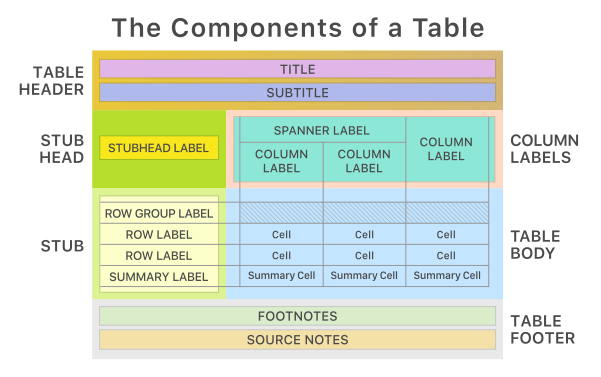
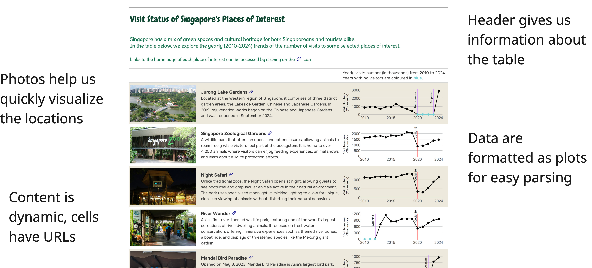
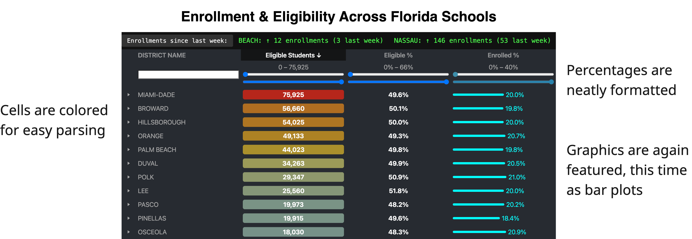
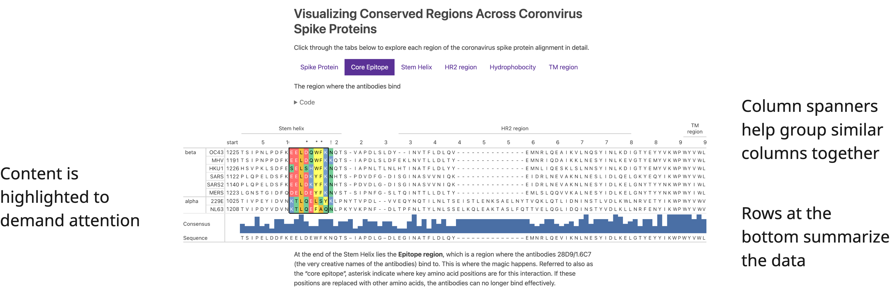
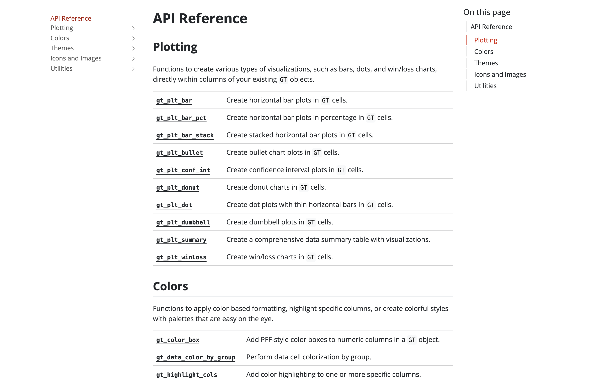
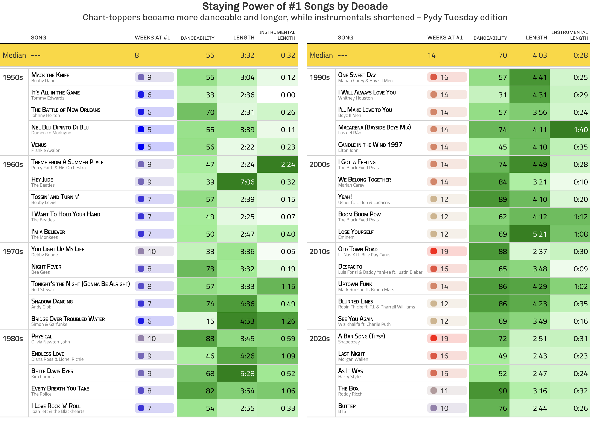

<!-- todo remove title -->

### About me

- Author of **gt-extras**
- Great Tables at Posit: Michael Chow and Richard Iannone
- I enjoy patterns and helping people see patterns

<!-- todo add image of myself? -->

::: {.notes}
I want to quickly introduce myself. I'm Jules, and I'm the author of gt-extras and a contributor to Great Tables.

Been at posit 6 months

Am into patterns and puzzles, and sports

Intersection of these is data visualization
:::

---

### The problem

> "They say a picture is worth a thousand words, so why do we have to look at tables with a thousand cells of text?"

---



::: {.notes}
You may have seen the talk abstract.

I got into tables because I was one of those people who liked to flip to the appendix to see what the actual difference was between 2015 and 2016 sales.

But when we look at a table, we have to look at 
:::

---

### The solution

::: {style="zoom: 50%;"}

```{python}
import polars as pl
from great_tables import GT, md, style, loc
import gt_extras as gte

nfl_df = pl.read_json("./assets/nfl_2011_stats.json")


def make_gt(df) -> GT:
    return (
        GT(df, rowname_col="Team", groupname_col="team_division")
        .tab_options(
            table_background_color="transparent",
            table_border_top_color="transparent",
            table_font_size="20px",
            heading_background_color="transparent",
        )
        .tab_header(
            title="2011 NFL Season at a Glance",
            subtitle="Super Bowl XLVI: New York Giants def. New England Patriots",
        )
        .tab_source_note(
            md(
                '<span style="float: right;">Source: [Lee Sharpe, nflverse](https://github.com/nflverse/nfldata)</span>'
            )
        )
        .tab_stubhead(label="Team")
        .tab_spanner(label="Scoring", columns=["Avg PF", "Avg PA", "Point Diff"])
        .tab_spanner(label="Season Trends", columns=["Games", "Streak"])
        .tab_style(style=style.fill("transparent"), locations=[loc.spanner_labels(["Season Trends", "Scoring"]), loc.column_header(), loc.stubhead()])
        .fmt_number(columns="Point Diff", decimals=1)
        .fmt_image("team_logo_espn", width="10%")
        .cols_hide(["Wins", "team_conf", "team_name", "team_logo_espn"])
        .cols_align(align="center", columns=["Avg PF", "Avg PA", "Games"])
        .cols_move("team_logo_espn", after="Team")
        .cols_label({"team_logo_espn": ""})
        .pipe(
            gte.gt_plt_winloss,
            column="Games",
            win_color="blue",
            loss_color="orange",
            tie_color="gray",
            height=40,
            width=120,
        )
        .pipe(
            gte.gt_fa_rank_change,
            column="Streak",
            icon_type="turn",
            color_up="blue",
            color_down="orange",
            size=14,
        )
        .pipe(
            gte.gt_plt_dumbbell,
            col1="Avg PF",
            col2="Avg PA",
            col1_color="green",
            col2_color="magenta",
            width=300,
            height=40,
            num_decimals=0,
            label="Points For vs Points Against",
            font_size=12,
        )
        .pipe(
            gte.gt_color_box,
            columns="Point Diff",
            palette=["green", "yellow", "red"],
            domain=[14, -14],
        )
        .pipe(gte.gt_highlight_cols, columns="Team", fill="lightgray")
        .pipe(gte.gt_highlight_rows, rows="NYG", fill="gold", alpha=0.3)
        .pipe(gte.gt_highlight_rows, rows="NE", fill="silver", alpha=0.3)
        .pipe(gte.gt_add_divider, columns="Point Diff", color="darkblue", weight=3)
        .pipe(gte.gt_theme_538)
    )


gt1 = make_gt(nfl_df.head(16))
gt2 = make_gt(nfl_df.slice(16, 16))

final_nfl_example = gte.gt_two_column_layout(gt1, gt2, table_header_from=1)

final_nfl_example
```

:::

---

### The solution

::::: {.columns}

::: {.column style="width: 60%; margin-top: 5%;"}


:::

::: {.column style="zoom: 45%; width: 40%;"}

```{python}
gt1
```

:::

:::::

---

### What did we really solve?

{.absolute width=1060.94px height=118px left=-15px top=303.357px}

:::{.fragment}
{.absolute width=146.808px height=115px left=665px top=144.84px}
:::

:::{.fragment}
{.absolute width=139.29px height=113.786px left=600px top=463.29px}
:::

::: {.notes}
We want to keep the data flow within python
:::

---

### Today's goals

::::: {.columns}

::: {.column width="40%"}

<br>
Understanding tables for data visualization

:::

::: {.column style="width: 60%; justify-items: center; display: inline-grid;"}

{height="200px"}

:::

:::::

::::: {.columns}

::: {.column width="40%"}

How to use **Great Tables**

:::

::: {.column style="width: 60%; justify-items: center; display: inline-grid;"}

{height="100px"}

:::

:::::

::::: {.columns}

::: {.column width="40%"}

Advanced use cases: **gt-extras**

:::

::: {.column style="width: 60%; zoom: 45%; justify-items: center; display: inline-grid;"}

```{python}
from great_tables import GT, loc, style
from great_tables.data import gtcars
import gt_extras as gte

# Setup dataframe
gtcars_mini = gtcars.iloc[5:13].copy().reset_index(drop=True)
gtcars_mini["efficiency"] = gtcars_mini["mpg_c"] / gtcars_mini["hp"] * 100

cars_gt_extras = (
    GT(gtcars_mini, rowname_col="model")
    .tab_stubhead(label="Car")
    .cols_hide(["drivetrain", "hp_rpm", "trq_rpm", "trim", "bdy_style", "msrp", "trsmn", "ctry_origin", "mpg_c"])
    .cols_align("center")
    .tab_header(title="Car Performance Review", subtitle="Using gt-extras functionality")
    .tab_options(
        table_background_color="transparent",
        table_border_top_color="transparent",
        table_font_size="20px",
        heading_background_color="transparent",
    )
    .tab_style(style.fill(color="transparent"), locations=[loc.column_labels(), loc.stubhead()])
    .cols_width({"mpg_h": "20px"})

    # Add gt-extras features using gt.pipe()
    .pipe(gte.gt_color_box, columns=["hp", "trq"], palette=["lightblue", "darkblue"])
    .pipe(gte.gt_plt_dot, category_col="mfr", data_col="efficiency", domain=[0, 0])
    .pipe(gte.gt_plt_bar, columns=["mpg_h"])
    .pipe(gte.gt_fa_rating, columns="efficiency")
    .pipe(gte.gt_hulk_col_numeric, columns="year", palette="viridis")
    .pipe(gte.gt_theme_538)
)

cars_gt_extras.show()
```

:::

:::::

::: {.notes}
You may not be convinced tables are up for the job.
So let's dissect what a presentation-level table looks like

Then, we'll see an example workflow of using great tables

Finally, I'll teach you a bit about gt-extras, which makes great tables shine even more
:::

---


## Posit 2025 Table Contest


---

### Jeremy Selva's Winning Entry



::: {.footer}
Check out [Jeremy's table entry](https://github.com/rich-iannone/table-contest/discussions/13)
:::

---

### Leo Ohyama's Winning Entry



::: {.footer}
Check out [Leo's table entry](https://github.com/rich-iannone/table-contest/discussions/16)
:::


---

### Victor Yuan's Winning Entry



::: {.footer}
Check out [Victor's table entry](https://github.com/rich-iannone/table-contest/discussions/10)
:::

---


<!-- section on what elements go into a table, as defined by great tables -->

### Table Structure

{fig-align="center" height="600"}


## (American) Football Example

::: {style="zoom: 50%;"}

```{python}
final_nfl_example
```

:::

---

### 0) Start with Data

```{python}
#| echo: true
#| eval: false
#| code-line-numbers: "1-6"
import polars as pl
from great_tables import GT, md, style, loc
import gt_extras as gte

nfl_df = pl.read_json("./assets/nfl_2011_stats.json")
nfl_df.head(8)
```

```{python}
#| echo: false

# setup
font_size = "13px"

import polars as pl
from great_tables import GT, md, style, loc
import gt_extras as gte
from IPython.display import HTML

nfl_df = pl.read_json("./assets/nfl_2011_stats.json")
display(HTML("<style>.dataframe { zoom: 45%; }</style>"))
nfl_df.head(8)
```

---

### 1) Convert to Great Table

```{python}
#| echo: true
#| eval: false
#| code-line-numbers: "1"
gt = GT(nfl_df.head(8))
```

```{python}
#| echo: false
gt = (
    GT(nfl_df.head(8))
    .tab_options(
        table_background_color="transparent",
        table_border_top_color="transparent",
        table_font_size=font_size,
    )
)
gt
```

---

### 2) Structure - Row Names & Groups

```{python}
#| echo: true
#| eval: false
#| code-line-numbers: "3-4"
gt = GT(
    nfl_df.head(8), 
    rowname_col="Team",
    groupname_col="team_division",
)
```

```{python}
#| echo: false
gt = (
    GT(nfl_df.head(8), rowname_col="Team", groupname_col="team_division")
    .tab_options(
        table_background_color="transparent",
        table_border_top_color="transparent",
        table_font_size=font_size,
    )
)
gt.tab_style(style=style.fill(color="lightblue"), locations=[loc.row_groups(), loc.stub()])
```

---

### 3) Structure - Header Labels

```{python}
#| echo: true
#| eval: false
#| code-line-numbers: "3-7"
gt = (
    GT(nfl_df.head(8), rowname_col="Team", groupname_col="team_division")
    .tab_header(
        title="2011 NFL Season",
        subtitle="Team Statistics"
    )
    .tab_stubhead(label="Team")
)
```

```{python}
#| echo: false
gt = (
    GT(nfl_df.head(8), rowname_col="Team", groupname_col="team_division")
    .tab_header(
        title="2011 NFL Season",
        subtitle="Team Statistics"
    )
    .tab_stubhead(label="Team")
    .tab_options(
        table_background_color="transparent",
        table_border_top_color="transparent",
        table_font_size=font_size,
    )
)
gt.tab_style(style=style.fill(color="lightblue"), locations=[loc.header(), loc.stubhead()])

```

---

### 4) Structure - Column Spanners

```{python}
#| echo: true
#| eval: false
#| code-line-numbers: "8-9"
gt = (
    GT(nfl_df.head(8), rowname_col="Team", groupname_col="team_division")
    .tab_header(
        title="2011 NFL Season",
        subtitle="Team Statistics"
    )
    .tab_stubhead(label="Team")
    .tab_spanner(label="Scoring", columns=["Avg PF", "Avg PA", "Point Diff"])
    .tab_spanner(label="Season Trends", columns=["Games", "Streak"])
)
```

```{python}
#| echo: false
gt = (
    GT(nfl_df.head(8), rowname_col="Team", groupname_col="team_division")
    .tab_header(
        title="2011 NFL Season",
        subtitle="Team Statistics"
    )
    .tab_stubhead(label="Team")
    .tab_spanner(label="Scoring", columns=["Avg PF", "Avg PA", "Point Diff"])
    .tab_spanner(label="Season Trends", columns=["Games", "Streak"])
    .tab_options(
        table_background_color="transparent",
        table_border_top_color="transparent",
        table_font_size=font_size,
    )
)

gt.tab_style(style=style.fill(color="lightblue"), locations=loc.spanner_labels(["Scoring", "Season Trends"]))
```

---

### 5) Format - Numerical Values

```{python}
#| echo: true
#| eval: false
#| code-line-numbers: "10"
gt = (
    GT(nfl_df.head(8), rowname_col="Team", groupname_col="team_division")
    .tab_header(
        title="2011 NFL Season",
        subtitle="Team Statistics"
    )
    .tab_stubhead(label="Team")
    .tab_spanner(label="Scoring", columns=["Avg PF", "Avg PA", "Point Diff"])
    .tab_spanner(label="Season Trends", columns=["Games", "Streak"])
    .fmt_number(columns="Point Diff", decimals=1)
)
```

```{python}
#| echo: false
gt = (
    GT(nfl_df.head(8), rowname_col="Team", groupname_col="team_division")
    .tab_header(
        title="2011 NFL Season",
        subtitle="Team Statistics"
    )
    .tab_stubhead(label="Team")
    .tab_spanner(label="Scoring", columns=["Avg PF", "Avg PA", "Point Diff"])
    .tab_spanner(label="Season Trends", columns=["Games", "Streak"])
    .fmt_number(columns="Point Diff", decimals=1)
    .cols_align(align="center", columns=["Avg PF", "Avg PA"])
    .tab_options(
        table_background_color="transparent",
        table_border_top_color="transparent",
        table_font_size=font_size,
    )
)
gte.gt_highlight_cols(gt, ["Point Diff"], include_column_labels=True, fill="lightblue")
```

---

### 6) Structure - Hide Unnecessary Columns

```{python}
#| echo: true
#| eval: false
#| code-line-numbers: "11"
gt = (
    GT(nfl_df.head(8), rowname_col="Team", groupname_col="team_division")
    .tab_header(
        title="2011 NFL Season",
        subtitle="Team Statistics"
    )
    .tab_stubhead(label="Team")
    .tab_spanner(label="Scoring", columns=["Avg PF", "Avg PA", "Point Diff"])
    .tab_spanner(label="Season Trends", columns=["Games", "Streak"])
    .fmt_number(columns="Point Diff", decimals=1)
    .cols_hide(["Wins", "team_conf", "team_name", "team_logo_espn"])
)
```

```{python}
#| echo: false
gt = (
    GT(nfl_df.head(8), rowname_col="Team", groupname_col="team_division")
    .tab_header(
        title="2011 NFL Season",
        subtitle="Team Statistics"
    )
    .tab_stubhead(label="Team")
    .tab_spanner(label="Scoring", columns=["Avg PF", "Avg PA", "Point Diff"])
    .tab_spanner(label="Season Trends", columns=["Games", "Streak"])
    .fmt_number(columns="Point Diff", decimals=1)
    .cols_align(align="center", columns=["Avg PF", "Avg PA"])
    .cols_width({"Point Diff": "20px"})
    .cols_hide(["Wins", "team_conf", "team_name", "team_logo_espn"])
    .tab_options(
        table_background_color="transparent",
        table_border_top_color="transparent",
        table_font_size=font_size,
    )
)
gt
```

---

### 7) Style - Add Color

::::: {.columns}

:::: {.column style="width: 33%; margin-right: 3%; margin-top: 10%;"}

```{python}
# | echo: true
# | eval: false
gt = gt.pipe(
    gte.gt_color_box,
    columns="Point Diff",
    palette=[
        "red",
        "yellow",
        "green",
    ],
    domain=[-14, 14],
)
```

::::

:::: {.column width="64%"}

```{python}
# | echo: false
gt = gt.pipe(
    gte.gt_color_box,
    columns="Point Diff",
    palette=["red", "yellow", "green"],
    domain=[-14, 14],
)
gte.gt_highlight_cols(gt, "Point Diff", include_column_labels=True, fill="lightblue")
```

::::

:::::

---

### 8) Format - gt-extras Win/Loss Visualization

::::: {.columns}

:::: {.column style="width: 33%; margin-right: 3%; margin-top: 10%;"}

```{python}
#| echo: true
#| eval: false
gt = gt.pipe(
    gte.gt_plt_winloss,
    column="Games",
    win_color="blue",
    loss_color="orange",
    width=100
)
```

::::

:::: {.column width="64%"}

```{python}
#| echo: false
gt = gt.pipe(
    gte.gt_plt_winloss,
    column="Games",
    win_color="blue",
    loss_color="orange",
    height=30,
    width=100
)
gte.gt_highlight_cols(gt, "Games", include_column_labels=True, fill="lightblue")
```

::::

:::::

---

### 9) Format - gt-extras Dumbbell Chart

::::: {.columns}

:::: {.column style="width: 33%; margin-right: 3%; margin-top: 10%;"}

```{python}
#| echo: true
#| eval: false
gt = gt.pipe(
    gte.gt_plt_dumbbell,
    col1="Avg PF",
    col2="Avg PA",
    col1_color="green",
    col2_color="magenta",
    width=250,
    label="Average Points For vs. Against"
)
```

::::

:::: {.column width="64%"}

```{python}
#| echo: false
gt = gt.pipe(
    gte.gt_plt_dumbbell,
    col1="Avg PF",
    col2="Avg PA",
    col1_color="green",
    col2_color="magenta",
    width=250,
    height=30,
    label="Average Points For vs. Against"
)
gte.gt_highlight_cols(gt, "Avg PF", include_column_labels=True, fill="lightblue")
```

::::

:::::

---

### 10) Format - gt-extras Streak Icons

::::: {.columns}

:::: {.column style="width: 33%; margin-right: 3%; margin-top: 10%;"}

```{python}
#| echo: true
#| eval: false
gt = gt.pipe(
    gte.gt_fa_rank_change,
    column="Streak",
    icon_type="turn",
    color_up="blue",
    color_down="orange"
)
```

::::

:::: {.column width="64%"}

```{python}
#| echo: false
gt = gt.pipe(
    gte.gt_fa_rank_change,
    column="Streak",
    icon_type="turn",
    color_up="blue",
    color_down="orange"
)
gte.gt_highlight_cols(gt, "Streak", include_column_labels=True, fill="lightblue")
```

::::

:::::

---

### 11) Structure - gt-extras Divider

::::: {.columns}

:::: {.column style="width: 33%; margin-right: 3%; margin-top: 10%;"}

```{python}
# | echo: true
# | eval: false
gt = gt.pipe(
    gte.gt_add_divider,
    columns="Point Diff",
    color="darkblue",
    weight=2,
)
```

::::

:::: {.column width="64%"}

```{python}
# | echo: false
gt = gt.pipe(
    gte.gt_add_divider,
    columns="Point Diff",
    color="darkblue",
    weight=2,
)
gt
```

::::

:::::

---

### 12) Style - gt-extras Theme

::::: {.columns}

:::: {.column style="width: 33%; margin-right: 3%; margin-top: 10%;"}

```{python}
# | echo: true
# | eval: false
gt = gt.pipe(
    gte.gt_theme_538,
)
```

::::

:::: {.column width="64%"}

```{python}
#| echo: false
gt = ( gt
    .pipe(gte.gt_theme_538)
    .tab_style(style=style.fill("transparent"), locations=[loc.spanner_labels(["Scoring", "Season Trends"]), loc.column_header(), loc.stubhead()])
)
gt
```

::::

:::::

---

### 13) Structure gt-extras Two-Column Table

::::: {.columns}

:::: {.column style="width: 42%; margin-right: 0%; margin-top: 10%;"}

```{python}
# | echo: true
# | eval: false


def make_gt(df: pl.DataFrame) -> GT:
    [build GT here]


gt1 = make_gt(nfl_df.head(16))
gt2 = make_gt(nfl_df.slice(16, 16))

gte.gt_two_column_layout(
    gt1,
    gt2,
    table_header_from=1,
)

```

::::

:::: {.column width="58%"}

::: {style="zoom: 40%;"}

```{python}
#| echo: false
final_nfl_example
```

:::

::::

:::::

---

### gt-extras

[](https://posit-dev.github.io/gt-extras/reference/)

---

### gt-extras

::::::: {.columns}

:::::: {.column width="30%"}

::: {.fragment fragment-index=1 .highlight-current-red}
Plotting
:::

::: {.fragment fragment-index=2 .highlight-current-red}
Coloring
:::

::: {.fragment fragment-index=3 .highlight-current-red}
Theming
:::

::: {.fragment fragment-index=4 .highlight-current-red}
Iconing + Imaging
:::

::: {.fragment fragment-index=5 .highlight-current-red}
Utilities
:::

::::::

:::::: {.column width="70%"}

::::: {.custom-stack }

:::: {.r-stack}

::: {.fragment fragment-index=1 .fade-in-then-out}

`gt_plt_bar()`

```{python}
from great_tables import GT
from great_tables.data import gtcars
import gt_extras as gte

gtcars_mini = gtcars.loc[
    9:17,
    ["model", "mfr", "year", "hp", "hp_rpm", "trq", "trq_rpm", "mpg_c", "mpg_h"]
]

gt = (
    GT(gtcars_mini, rowname_col="model")
    .tab_stubhead(label="Car")
    .cols_align("center")
    .cols_align("left", columns="mfr")
    .tab_options(
        table_background_color="transparent",
        table_border_top_color="transparent",
        table_width="350px",
        table_font_size="21px",
    )
)

gt.pipe(
    gte.gt_plt_bar,
    columns= ["hp", "hp_rpm", "trq", "trq_rpm", "mpg_c", "mpg_h"]
)
```
:::

::: {.fragment fragment-index=2 .fade-in-then-out}

`gt_color_box()`
```{python}
from great_tables import GT
from great_tables.data import islands
import gt_extras as gte

islands_mini = (
    islands
    .sort_values(by="size", ascending=False)
    .head(10)
)

gt = (
    GT(islands_mini, rowname_col="name")
    .tab_stubhead(label="Island")
    .tab_options(
        table_background_color="transparent",
        table_border_top_color="transparent",
        table_width="300px",
        table_font_size="20px",
    )
)

gt.pipe(gte.gt_color_box, columns="size", palette=["lightblue", "navy"])
```
:::

::: {.fragment fragment-index=3 .fade-in-then-out}

`gt_theme_dot_matrix()`
```{python}
from great_tables import GT, html
import gt_extras as gte
from great_tables.data import airquality

# Prepare the dataset
airquality_mini = airquality.head(10).assign(Year=1973)

# Create the base table
gt = (
    GT(airquality_mini)
    .tab_header(
        title="Dot Matrix Theme",
        subtitle="New York Air Quality Measurements",
    )
    .tab_spanner(label="Time", columns=["Year", "Month", "Day"])
    .tab_spanner(
        label="Measurement",
        columns=["Ozone", "Solar_R", "Wind", "Temp"],
    )
    .cols_move_to_start(columns=["Year", "Month", "Day"])
    .cols_label(
        Ozone=html("Ozone,<br>ppbV"),
        Solar_R=html("Solar R.,<br>cal/m<sup>2</sup>"),
        Wind=html("Wind,<br>mph"),
        Temp=html("Temp,<br>&deg;F"),
    )
    .tab_options(
        table_background_color="transparent",
        table_border_top_color="transparent",
        table_width="320px",
        table_font_size="28px",
    )
)

gt.pipe(gte.gt_theme_dot_matrix)
```

:::

::: {.fragment fragment-index=4 .fade-in-then-out}

`fa_icon_repeat()`
```{python}
import pandas as pd
from great_tables import GT
from great_tables.data import countrypops
import gt_extras as gte

countries_2020 = (
    countrypops
    .query("year == 2020")
    .sort_values("population", ascending=False)
    .iloc[[2, 5, 10, 20, 28, 38, 65, 80, 98]]
)

# Scale: 1 icon = 10 million people
def create_population_icons(population):
    icon_count = max(1, round(population / 10_000_000))

    return gte.fa_icon_repeat(
        name="person",
        repeats=icon_count,
        fill="cornflowerblue",
    )

# Prepare the data
df = pd.DataFrame({
    "Country": countries_2020["country_name"],
    "Population": countries_2020["population"],
    "People": [create_population_icons(pop) for pop in countries_2020["population"]],
})

(
    GT(df)
    .tab_header(
        title="World Population in 2020",
        subtitle="Each person icon represents ~10 million people"
    )
    .fmt_number(
        columns="Population",
        decimals=0
    )
    .tab_options(
        table_background_color="transparent",
        table_border_top_color="transparent",
        table_width="720px",
        table_font_size="20px",
    )
)
```

:::

::: {.fragment fragment-index=5 .fade-in-then-out}

`fmt_pct_extra()`
```{python}
from great_tables import GT
from great_tables.data import towny
import gt_extras as gte

towny_mini = towny[
    [
        "name",
        "pop_change_1996_2001_pct",
        "pop_change_2001_2006_pct",
        "pop_change_2006_2011_pct",
    ]
].tail(10)

gt = (
    GT(towny_mini)
    .tab_spanner(label="Population Change", columns=[1, 2, 3])
    .cols_label(
        pop_change_1996_2001_pct="'96-'01",
        pop_change_2001_2006_pct="'01-'06",
        pop_change_2006_2011_pct="'06-'11",
    )
    .tab_options(
        table_background_color="transparent",
        table_border_top_color="transparent",
        table_width="540px",
        table_font_size="20px",
    )
)

gt.pipe(
    gte.fmt_pct_extra,
    columns=[1, 2, 3],
    threshold=5,
    color="green",
)
```

:::

::::

:::::

::::::

:::::::

--- 

### gt-extras

](./assets/images/examples.png){width="80%"}

---

## What's Next

:::: {.columns}

::: {.column width="30%"}

::::: {.nonincremental}
- Summary Rows
- Latex
- Whatever you want!
:::::

:::

::: {.column width="70%"}

:::

::::

---

### What Else is Next?

{.absolute width=1060.94px height=118px left=-15px top=303.357px}

:::{.fragment}
{.absolute width=146.808px height=115px left=665px top=144.84px}
:::

:::{.fragment}
{.absolute width=139.29px height=113.786px left=600px top=463.29px}
:::

:::{.fragment}
{.absolute width=146.808px height=115px left=878px top=144.84px}
:::

:::{.fragment}
{.absolute width=139.29px height=113.786px left=813px top=463.29px}
:::

::: {.notes}
We want to keep the data flow within python
:::

---

### Thank you

::: {.fragment fragment-index=1}
to Michael Chow and Richard Ianonne (and the Posit family)
:::


:::::: {.fragment fragment-index=2}

::::: {.columns}

::: {.column width="60%"}

- [Great Tables](https://posit-dev.github.io/great-tables/)

- [gt-extras](https://posit-dev.github.io/gt-extras/)

- [2025 Table Contest](https://posit.co/blog/2025-table-contest-winners/)

:::

::: {.column width="40%"}


:::

:::::

::::::

::: footer
Find the slides [on my website, juleswg.me](https://juleswg.me/talks/Great-Tables-and-More-Nov-19/index.html)
:::
