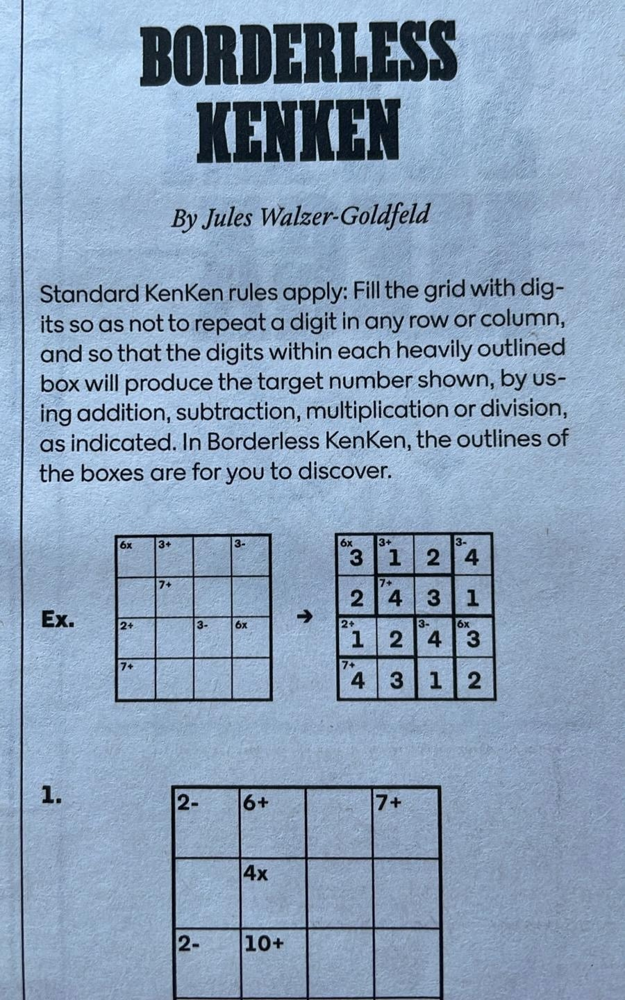
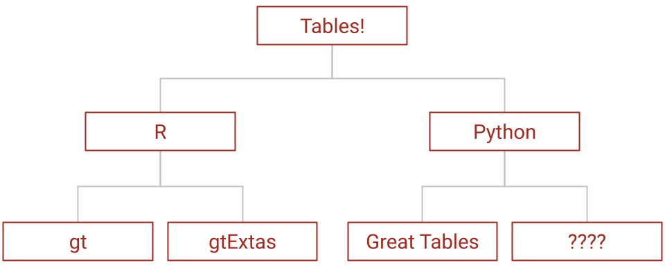

<!-- 
Abstract

They say a picture is worth a thousand words, so why do we have to look at tables with a thousand cells of text?

In this session, we’ll explore the Great Tables package for Python, a powerful tool for creating clear, polished, and publication-ready tables.

We’ll also dive into gtExtras, an extension package that lets you embed small plots directly into your tables bringing your data to life, one cell at a time. Whether you’re building reports, dashboards, or presentations, these tools will help you turn tables into a powerful medium for data storytelling.

Finally, we’ll showcase inspiring and creative entries from the 2025 Table Contest, celebrating what’s possible when data and design come together in tabular form.
-->

# Hello!

## Who are you listening to

::::: {.columns}

::: {.column width="70%"}

- 📊 gt-extras author, and Great Tables contributor

- 💡 I enjoy patterns and helping people see patterns

- 🧗 I like to play table tennis, soccer, chess, and climb rocks

- 🔢 I like logic puzzles!

:::

::: {.column width="30%" .fragment}

:::

:::::

# What is Great Tables

<!-- First Great Tables slide -->
## Great Tables

<!--  -->


<!-- Second Great Tables slide -->
## Great Tables

<!-- [](https://posit-dev.github.io/gt-extras/reference/) -->

<!-- Third Great Tables slide -->
## Great Tables


### Examples

](./assets/images/examples.png){width="80%"}

---

### NFL Example

::: {style="width: 1600px; zoom: 45%;"}

```{python}
import polars as pl
from great_tables import GT, md, style, loc
import gt_extras as gte

nfl_df = pl.read_json("./assets/nfl_2011_stats.json")


def make_gt(df) -> GT:
    return (
        GT(df, rowname_col="Team", groupname_col="team_division")
        .tab_options(
            table_background_color="transparent",
            table_border_top_color="transparent",
            table_font_size="20px",
            heading_background_color="transparent",
        )
        .tab_header(
            title="2011 NFL Season at a Glance",
            subtitle="Super Bowl XLVI: New York Giants def. New England Patriots",
        )
        .tab_source_note(
            md(
                '<span style="float: right;">Source: [Lee Sharpe, nflverse](https://github.com/nflverse/nfldata)</span>'
            )
        )
        .tab_stubhead(label="Team")
        .tab_spanner(label="Scoring", columns=["Avg PF", "Avg PA", "Point Diff"])
        .tab_spanner(label="Season Trends", columns=["Games", "Streak"])
        .tab_style(style=style.fill("transparent"), locations=[loc.spanner_labels(["Season Trends", "Scoring"]), loc.column_header(), loc.stubhead()])
        .fmt_number(columns="Point Diff", decimals=1)
        .fmt_image("team_logo_espn")
        .cols_hide(["Wins", "team_conf", "team_name"])
        .cols_align(align="center", columns=["Avg PF", "Avg PA", "Games"])
        .cols_move("team_logo_espn", after="Team")
        .cols_label({"team_logo_espn": ""})
        .pipe(
            gte.gt_plt_winloss,
            column="Games",
            win_color="blue",
            loss_color="orange",
            tie_color="gray",
            height=40,
            width=120,
        )
        .pipe(
            gte.gt_fa_rank_change,
            column="Streak",
            icon_type="turn",
            color_up="blue",
            color_down="orange",
            size=14,
        )
        .pipe(
            gte.gt_plt_dumbbell,
            col1="Avg PF",
            col2="Avg PA",
            col1_color="green",
            col2_color="red",
            width=300,
            height=40,
            num_decimals=0,
            label="Points For vs Points Against",
            font_size=12,
        )
        .pipe(
            gte.gt_color_box,
            columns="Point Diff",
            palette=["green", "yellow", "red"],
            domain=[14, -14],
        )
        .pipe(gte.gt_highlight_cols, columns="Team", fill="lightgray")
        .pipe(gte.gt_highlight_rows, rows="NYG", fill="gold", alpha=0.3)
        .pipe(gte.gt_highlight_rows, rows="NE", fill="silver", alpha=0.3)
        .pipe(gte.gt_add_divider, columns="Point Diff", color="darkblue", weight=3)
        .pipe(gte.gt_theme_538)
    )


gt1 = make_gt(nfl_df.head(16))
gt2 = make_gt(nfl_df.slice(16, 16))

gte.gt_two_column_layout(gt1, gt2, table_header_from=1)
```

:::

---
### Highlight some example here

<!-- New section -->

## gt-extras

:::::: {.columns}

:::::: {.column width="30%"}

::: {.fragment fragment-index=1 .highlight-current-red}
Plotting
:::

::: {.fragment fragment-index=2 .highlight-current-red}
Coloring
:::

::: {.fragment fragment-index=3 .highlight-current-red}
Theming
:::

::: {.fragment fragment-index=4 .highlight-current-red}
Iconing + Imaging
:::

::::::

:::::: {.column width="70%"}

:::::{.custom-stack }

:::: {.r-stack}

::: {.fragment fragment-index=1 .fade-in-then-out}

`gt_plt_bar()`
```{python}
from great_tables import GT
from great_tables.data import gtcars
import gt_extras as gte

gtcars_mini = gtcars.loc[
    9:17,
    ["model", "mfr", "year", "hp", "hp_rpm", "trq", "trq_rpm", "mpg_c", "mpg_h"]
]

gt = (
    GT(gtcars_mini, rowname_col="model")
    .tab_stubhead(label="Car")
    .cols_align("center")
    .cols_align("left", columns="mfr")
    .tab_options(
        table_background_color="transparent",
        table_border_top_color="transparent",
        table_width="350px",
        table_font_size="21px",
    )
)

gt.pipe(
    gte.gt_plt_bar,
    columns= ["hp", "hp_rpm", "trq", "trq_rpm", "mpg_c", "mpg_h"]
)
```
:::

::: {.fragment fragment-index=2 .fade-in-then-out}

`gt_color_box()`
```{python}
from great_tables import GT
from great_tables.data import islands
import gt_extras as gte

islands_mini = (
    islands
    .sort_values(by="size", ascending=False)
    .head(10)
)

gt = (
    GT(islands_mini, rowname_col="name")
    .tab_stubhead(label="Island")
    .tab_options(
        table_background_color="transparent",
        table_border_top_color="transparent",
        table_width="300px",
        table_font_size="20px",
    )
)

gt.pipe(gte.gt_color_box, columns="size", palette=["lightblue", "navy"])
```
:::

::: {.fragment fragment-index=3 .fade-in-then-out}

`gt_theme_dot_matrix()`
```{python}
from great_tables import GT, html
import gt_extras as gte
from great_tables.data import airquality

# Prepare the dataset
airquality_mini = airquality.head(10).assign(Year=1973)

# Create the base table
gt = (
    GT(airquality_mini)
    .tab_header(
        title="Dot Matrix Theme",
        subtitle="New York Air Quality Measurements",
    )
    .tab_spanner(label="Time", columns=["Year", "Month", "Day"])
    .tab_spanner(
        label="Measurement",
        columns=["Ozone", "Solar_R", "Wind", "Temp"],
    )
    .cols_move_to_start(columns=["Year", "Month", "Day"])
    .cols_label(
        Ozone=html("Ozone,<br>ppbV"),
        Solar_R=html("Solar R.,<br>cal/m<sup>2</sup>"),
        Wind=html("Wind,<br>mph"),
        Temp=html("Temp,<br>&deg;F"),
    )
    .tab_options(
        table_background_color="transparent",
        table_border_top_color="transparent",
        table_width="320px",
        table_font_size="28px",
    )
)

gt.pipe(gte.gt_theme_dot_matrix)
```

:::

::: {.fragment fragment-index=4 .fade-in-then-out}

`gt_fa_rank_change()`
```{python}
from great_tables import GT
from great_tables.data import towny
import gt_extras as gte

mini_towny = towny.head(10)
gt = GT(mini_towny).cols_hide(None).cols_unhide("name")

columns = [
    "pop_change_1996_2001_pct",
    "pop_change_2001_2006_pct",
    "pop_change_2006_2011_pct",
]

for col in columns:
    gt = (
        gt
        .cols_align(columns=col, align="center")
        .cols_unhide(col)
        .cols_label({col: col[11:20]})
        .tab_options(
            table_background_color="transparent",
            table_border_top_color="transparent",
            table_width="320px",
            table_font_size="20px",
        )

        .pipe(
            gte.gt_fa_rank_change,
            column=col,
            neutral_range=[-0.01, 0.01],
        )
    )

gt
```

:::

::::

:::::

::::::

:::::::

# Table Contest 2025

## Subheader

# Thank you

::: {.nonincremental}

- Rich Iannone and Michael Chow
- Many other Posit folks who have worked hard on these projects (Andrew, Hassan, Jeroen)

:::


{width="40%" .absolute top=-30 right=20}

::: footer
(These slides are on my new personal site 👉 [juleswg.me](https://juleswg.me))
:::