<!--
NOTE FOR AGENTS: Do not add speaker notes to this file. 
Jules will add speaker notes later.
-->

<!-- 
Images:
bike_drivetrain: Photo by Mathias Reding: https://www.pexels.com/photo/close-up-photo-of-bicycle-gears-13415392/
bike_tail_light: Photo by chatchawarn loetsupan: https://www.pexels.com/photo/close-up-of-a-back-light-on-a-bicycle-10744841/
bike_bell: Photo by Nick Duell: https://www.pexels.com/photo/brass-bicycle-bell-107510/
bike_with_basket: Photo by Martii Tolentino: https://www.pexels.com/photo/man-and-woman-riding-bicycle-on-crosswalk-18529803/
generic_bike: Photo by Pixabay: https://www.pexels.com/photo/black-fixed-gear-bike-beside-wall-276517/ (or my bike)
wireless_mouse: Photo by Gül Işık: https://www.pexels.com/photo/black-wireless-mouse-beside-laptop-2272759/
lunch_and_fork: Photo by Jacob  Yavin: https://www.pexels.com/photo/snack-meal-inside-a-lunch-box-12861383/
bike_backpack: Photo by ronyescobarhn  : https://www.pexels.com/photo/cyclist-enjoying-sunny-beach-boulevard-ride-34975805/
two_bikes: Photo by Jan van der Wolf: https://www.pexels.com/photo/red-electric-bicycles-in-a-scenic-outdoor-setting-30179590/
saddle_bags: Photo by Pack2Ride: https://www.pexels.com/photo/a-bicycle-on-the-road-8934535/
stick_figures: Photo by Tara Winstead: https://www.pexels.com/photo/an-illustration-of-stick-people-8378752/
-->

### About Me

- Author of **gt-extras**
- Great Tables at Posit: Michael Chow and Richard Iannone
- I enjoy 🏓, ⚽, 🧗, 🚴

# Biking

## Roommate Story
:::: {.r-stack}

::: {.fragment fragment-index=1 .fade-in-then-out}

{width=9in}

:::


::: {.fragment fragment-index=2}

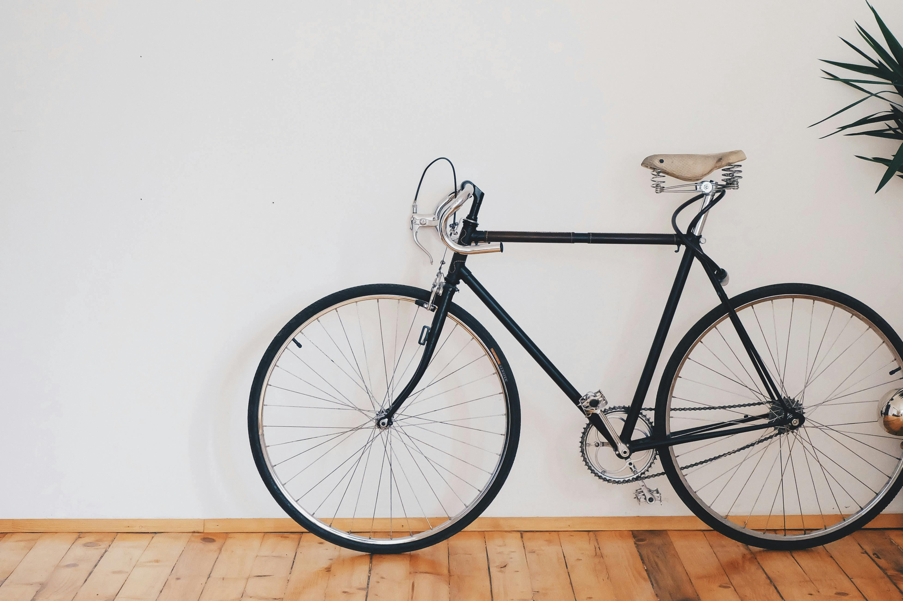{width=9in}

:::

::::

::: {.footer}

Photos by Tara Winstead: https://www.pexels.com/photo/an-illustration-of-stick-people-8378752/

and Pixabay: https://www.pexels.com/photo/black-fixed-gear-bike-beside-wall-276517/

:::

---

## Maintenance, Upgrades

::::: {.columns}

:::: {.column width="3.965in"}

::: {.fragment fragment-index=1}

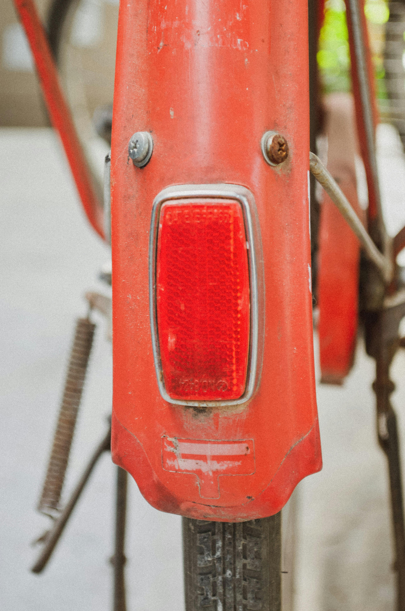

:::

::::

:::: {.column}

::: {.fragment fragment-index=2}

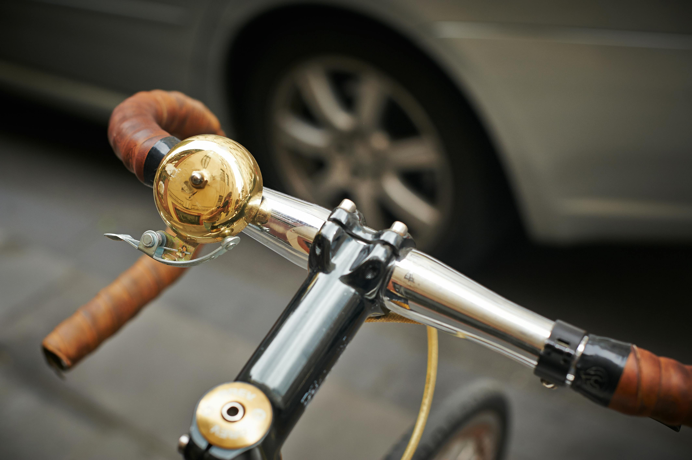{width=3.8in}

:::

::: {.fragment fragment-index=3}

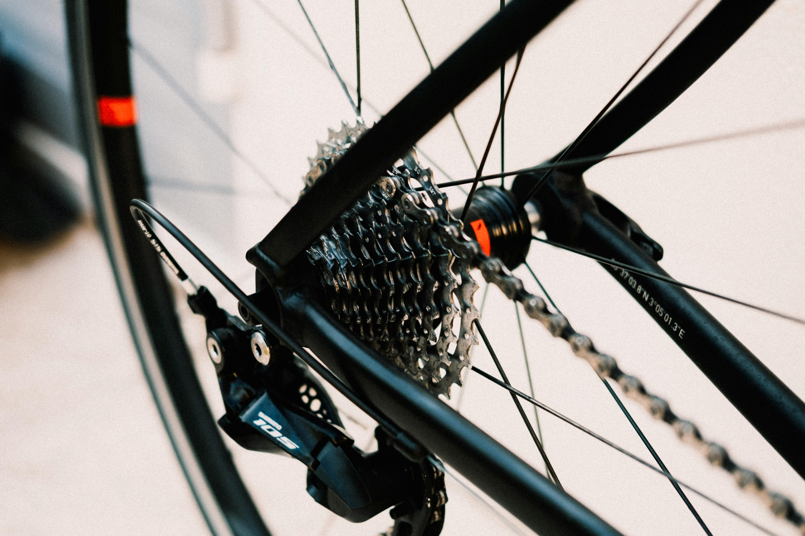{width=3.8in}

:::

::::

:::::

::: {.footer}
Photos by chatchawarn loetsupan: https://www.pexels.com/photo/close-up-of-a-back-light-on-a-bicycle-10744841/

Nick Duell: https://www.pexels.com/photo/brass-bicycle-bell-107510/

and Mathias Reding: https://www.pexels.com/photo/close-up-photo-of-bicycle-gears-13415392/
:::

---

## You Borrow It

::::: {.columns}

:::: {.column}

::: {.fragment fragment-index=1}


:::

::::

:::: {.column width="46.9%"}

::: {.fragment fragment-index=2}

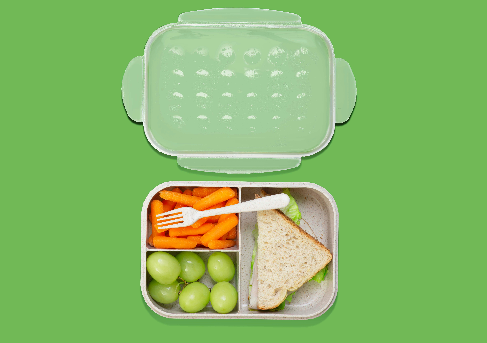

:::

::::

:::::

::: {.footer}
Photos by Gül Işık: https://www.pexels.com/photo/black-wireless-mouse-beside-laptop-2272759/

and Jacob Yavin: https://www.pexels.com/photo/snack-meal-inside-a-lunch-box-12861383/
:::

---

## Solve It For Yourself

::: {.fragment fragment-index=1}

{width=9in}

:::

::: {.footer}
Photo by ronyescobarhn: https://www.pexels.com/photo/cyclist-enjoying-sunny-beach-boulevard-ride-34975805/ 
:::

---

## Modify The Bike For Everyone

::: {.fragment fragment-index=1}

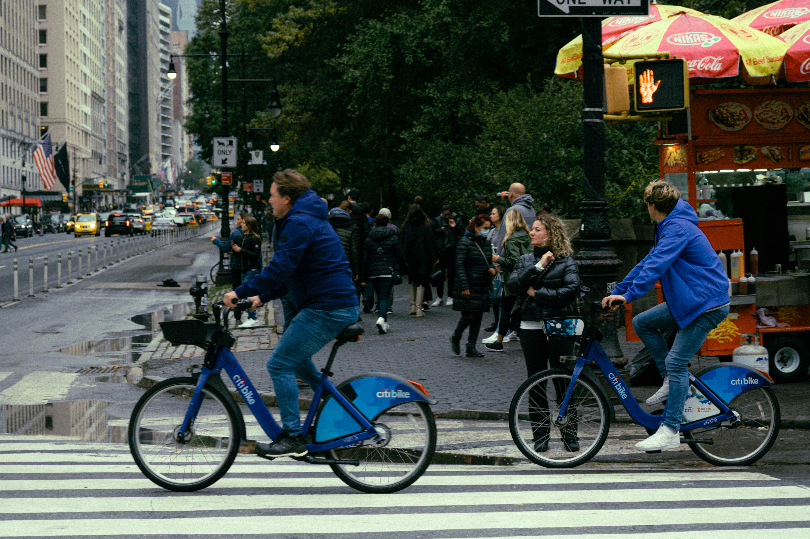{width=9in}

:::

::: {.footer}
Photo by Martii Tolentino: https://www.pexels.com/photo/man-and-woman-riding-bicycle-on-crosswalk-18529803/
:::

---

## Fork The Bike

::: {.fragment fragment-index=1}

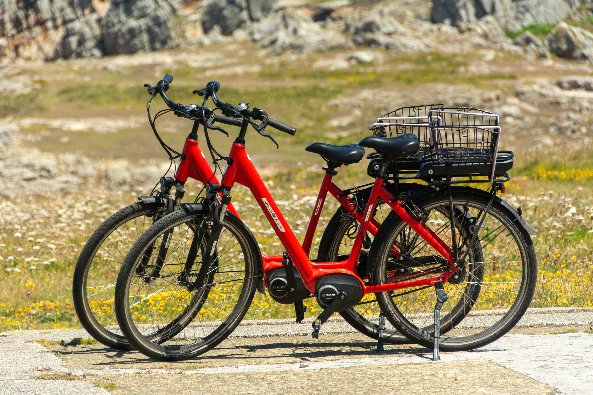{width=9in}

:::

::: {.footer}
Photo by Jan van der Wolf: https://www.pexels.com/photo/red-electric-bicycles-in-a-scenic-outdoor-setting-30179590/
:::

---

## Use An Optional Attachment

::: {.fragment fragment-index=1}

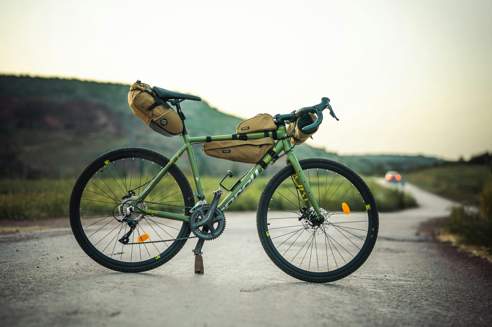{width=9in}

:::

::: {.footer} 
Photo by Pack2Ride: https://www.pexels.com/photo/a-bicycle-on-the-road-8934535/
:::

# Developing Packages

## Programming story

::::: {.r-stack}

::: {.fragment fragment-index=1 .fade-in-then-out}

{width=9in}

:::

:::: {layout-nrow="2"}

::: {.fragment fragment-index=2}

{width=3in height=0.5in style="margin-bottom: 0em !important;"}

:::

::: {.fragment fragment-index=3}

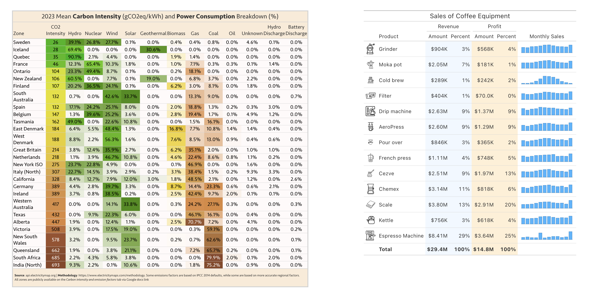{width=9in}

:::

::::

:::::

::: {.notes}
Your roommates developed a package, (Michael and Richard)
:::

---

## Maintenance, Upgrades

::: {.fragment fragment-index=1}

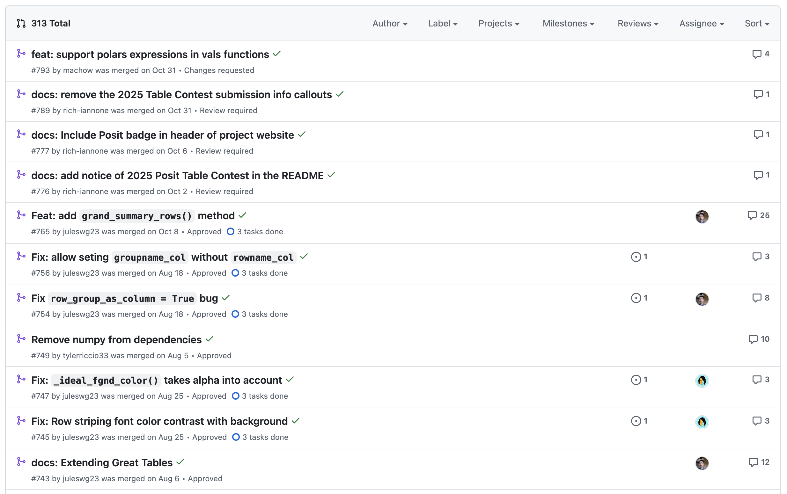{width=10in}

:::

---

## You Borrow It

::: {.panel-tabset style="zoom: 90%; font-size: 36px;"}

## The Dataset

```{python}
import polars as pl

pre_tax_col = "gini_market__age_total"
post_tax_col = "gini_disposable__age_total"

df = pl.read_csv("./assets/income_inequality.csv")

df
```

## Great Table

```{python}
from great_tables import GT, html
import gt_extras as gte

df_with_icons = df.with_columns(
    pl.col("pop_icons").map_elements(
        lambda x: gte.fa_icon_repeat(name="person", repeats=int(x)),
        return_dtype=pl.String,
    )
)

# Generate the table, before gt-extras add-ons
gt = (
    GT(df_with_icons, rowname_col="Entity", groupname_col="owid_region")
    .tab_header(
        "Income Inequality Before and After Taxes in 2020",
    )
    .cols_move("pop_icons", after=pre_tax_col)
    .cols_align("left")
    .cols_hide(["Year", "pop_log", "population_historical"])
    .fmt_flag("Code")
    .cols_label(
        {
            "Code": "",
            "gini_pct_change": "Improvement Post Taxes",
            "pop_icons": "Population",
        }
    )
    .with_id("gini-table")
)

gt
```

## Your Great(er) Table

```{python}
import gt_extras as gte

gt_extra = gt.pipe(
    gte.gt_plt_dumbbell,
    col1=pre_tax_col,
    col2=post_tax_col,
    col1_color="#e0b165",
    col2_color="#106ea0",
    dot_border_color="transparent",
    num_decimals=2,
    width=240,
    label="Pre-tax to Post-tax Coefficient",
).pipe(
    gte.gt_plt_bullet,
    "gini_pct_change",
    "gini_pct_benchmark_5yr",
    fill="#963d4c",
    target_color="#3D3D3D",
    bar_height=15,
    width=200,
).pipe(
    gte.gt_merge_stack,
    col1="pop_icons",
    col2="population_historical",
).pipe(gte.gt_theme_guardian)

gt_extra
```

:::

---

## Solve It For Yourself

### Write It Locally

:::: {.r-stack}

::: {.fragment fragment-index=1 .fade-in-then-out}

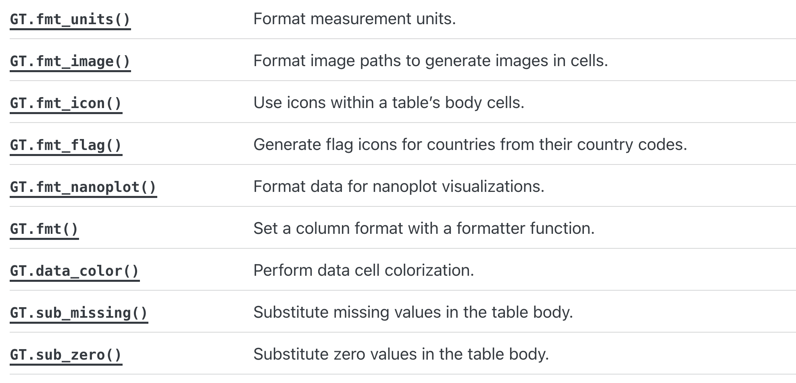{width=10in}

:::

::: {.fragment fragment-index=2}


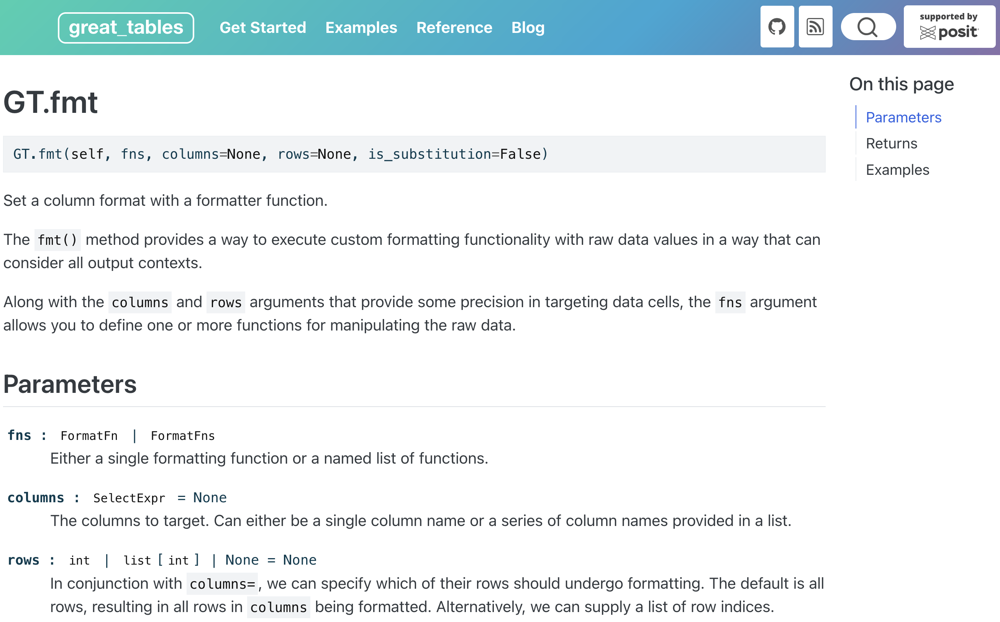{width=9in}

:::

::::

<!-- Build it in your notebook, in your scripts, in your project code.

Pros/cons
It works for you. But it breaks for your colleague. It doesn't scale. -->

---

## ~~Modify The Bike~~ For Everyone

### *Submit a PR* For Everyone

::: {.fragment fragment-index=1}

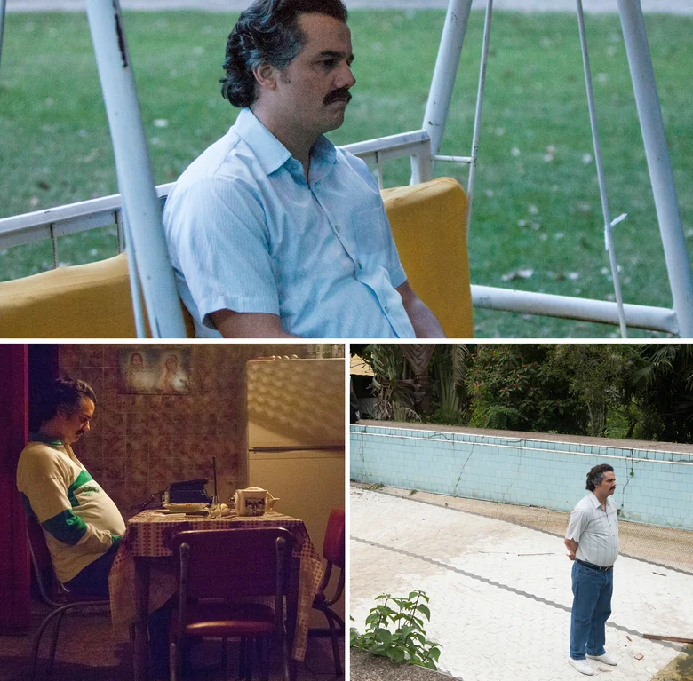{width=5.75in}

:::


<!-- 3 Hope it get's built in to the library

pros/cons
Submit your feature request, your code review, hope they say yes. Six months later, maybe they do, Maybe they don't. -->

---

## Fork The ~~Bike~~

### Fork the *Package*

<!-- Fork the repo
pros/cons 
maintaining a shadow version of a library you didn't write, forever watching for updates you have to manually merge. -->

---

## ~~Use An Optional Attachment~~

### *Build A Companion Package*

This is what **gt-extras** did for Great Tables. 

Say this?
What **nbmail** and **red-mail** did for `smtplib`. What **requests-toolbelt** did for `requests`. 

Or use it for when we are comparing extenders to wrappers?


<!-- For the above examples doing each solution -->

<!-- describe what the option is, with an image-->

<!-- list out some advantages and painful aspects of the solution  -->


# Actually Developing Packages

---

## What's Missing

::: {.columns style="margin-top: 100px;"}

:::: {.column style="width: 40%;"}

```{python}
(
    gt
    .cols_hide(["Code", "gini_pct_benchmark_5yr", "pop_icons"])
    .tab_options(table_font_size="80%")
    .cols_label({"gini_disposable__age_total": "Pre-Tax", "gini_market__age_total": "Post-Tax"})
)
```

::::

:::: {.column style="width: 60%;"}


```{python}
(
    gt_extra
    .cols_hide(["Code", "pop_icons"])
)
```

::::

:::

---

## Where Do We Start?

::: {.two-column-code}

```{python}
# | echo: true
# | output-location: column
from great_tables import GT, html
from great_tables.data import airquality

airquality_mini = airquality.head(10).assign(Year=1973)

gt = (
    GT(airquality_mini)
    .tab_header(
        title="Default Theme",
        subtitle="New York Air Quality Measurements",
    )
    .tab_spanner(label="Time", columns=["Year", "Month", "Day"])
    .tab_spanner(
        label="Measurement",
        columns=["Ozone", "Solar_R", "Wind", "Temp"],
    )
    .cols_move_to_start(columns=["Year", "Month", "Day"])
    .cols_label(
        Ozone=html("Ozone,<br>ppbV"),
        Solar_R=html("Solar R.,<br>cal/m<sup>2</sup>"),
        Wind=html("Wind,<br>mph"),
        Temp=html("Temp,<br>&deg;F"),
    )
)

gt
```

:::

---

## Where Do We Start?

:::: {layout-ncol="2"}

::: {.placeholder-class}

```{python}
gt
```

:::

:::  {.fragment fragment-index=1}

```{python}
gt.pipe(gte.gt_theme_dot_matrix)
```

:::

::::

---

### The Wrapper Pattern

:::: {.columns}

::: {.column width=40%}

```{python}
gt.pipe(gte.gt_theme_dot_matrix)
```

:::

::: {.column .fragment fragment-index=1 style="font-size:65%;"}

```{python}
# | echo: true
# | output: false
(
    gt
    .opt_row_striping()
    .opt_table_font(font="Courier")
    .tab_options(
        heading_align="left",
        heading_border_bottom_color="white",
        column_labels_text_transform="lowercase",
        column_labels_font_size="85%",
        column_labels_border_top_style="none",
        column_labels_border_bottom_color="black",
        column_labels_border_bottom_width="2px",
        table_border_bottom_style="none",
        table_border_bottom_width="2px",
        table_border_bottom_color="white",
        table_border_top_style="none",
        row_striping_background_color="#b5dbb6",
        table_body_hlines_style="none",
        table_body_vlines_style="none",
        data_row_padding="1px",
    )
)
```

:::

::::

---

## Title TBD

```{python}
# | echo: true
# | output: false
# | code-line-numbers: "|1-2,11-13"
def gt_theme_dot_matrix(gt: GT, color: str = "#b5dbb6") -> GT:
    gt_themed = (
        gt
        .opt_row_striping()
        .opt_table_font(font="Courier")
        .tab_options(
            heading_align="left",
            column_labels_text_transform="lowercase",
            row_striping_background_color=color,
        )
    )

    return gt_themed
```


---

## Second Challenge: But What About...?

You've written your wrapper. It works. But now the maintainer releases a new version of the upstream library, and suddenly everything breaks. Now you have to think like a real package maintainer.

*"You wrote your wrapper. Great! But now the maintainer updates the upstream library and... everything breaks."*

---

### Challenge 2a: Compatibility Testing

What happens when Great Tables releases version 0.5, and your package was written for version 0.3? You probably don't want to find out from your users.

The solution is automated testing against multiple versions. You set up CI/CD to test your package against the current version, the version before that, maybe the next one. This runs automatically every time Great Tables updates. You know immediately what breaks.

**Principle:** "Stay compatible. Test against multiple versions. Document what you support."

---

### Challenge 2b: Respecting the Original API

Here's a subtle but important principle: your package should feel like a natural extension of the upstream library, not a replacement or a hack.

Don't subclass the upstream objects. Don't monkey-patch them. Instead, take them as input to your functions, modify them, return them. This respects the original design and makes your package composable—your functions can chain with upstream functions without confusion.

**Principle:** "Extend, don't replace. Your package should feel like a natural extension of the original."

---

## Third Challenge: Making It Real

You've learned to wrap. You've learned to test. Now you have a working companion package. But it's only working on your machine. How do you make it something other people can use?

*"I have a working wrapper. How do I make it something others can actually use?"*

---

### Package Structure

The structure of a real companion package. You have your source code. You have tests. You have configuration that describes your package to the world: what it's called, what version it is, what it depends on.

Documentation

---

### Configuration & Exports

Your configuration file declares the essentials: name, version, dependencies, and which of those dependencies are optional. Your __init__.py file tells Python which functions to expose to users. When someone imports your package, they get exactly what you put there.

This is where the power of composition shines. You're not hiding anything. You're just organizing what you've built.

**Principle:** "Keep it minimal. Don't over-engineer on day one."

---

## Your Transformation

You came here with a problem. You loved a library, but it wasn't enough.

You learned that companion packages aren't magic. They're a pattern. Import, wrap, compose, extend. You saw that the pattern works—real packages do it this way, successfully, at scale.

You learned to think about dependencies, compatibility, and respect for the original design. You learned that distribution is learnable, not mysterious.

You're no longer the person who forks or waits or hacks. You're the person who builds.

---

## Thank You

::: footer
Find these slides at [juleswg.me](https://juleswg.me)
:::

---

## icebox

::: {.panel-tabset .custom-font-size .first-tabset }


## Read the dataset

```{python}
# | echo: true
# | output-location: column
import polars as pl

pre_tax_col = "gini_market__age_total"
post_tax_col = "gini_disposable__age_total"

df = pl.read_csv("./assets/income_inequality.csv")

df
```

## What We Have

```{python}
# | echo: true
# | output-location: column
from great_tables import GT, html
import gt_extras as gte

df_with_icons = df.with_columns(
    pl.col("pop_icons").map_elements(
        lambda x: gte.fa_icon_repeat(name="person", repeats=int(x)),
        return_dtype=pl.String,
    )
)

# Generate the table, before gt-extras add-ons
gt = (
    GT(df_with_icons, rowname_col="Entity", groupname_col="owid_region")
    .tab_header(
        "Income Inequality Before and After Taxes in 2020",
    )
    .cols_move("pop_icons", after=pre_tax_col)
    .cols_align("left")
    .cols_hide(["Year", "pop_log", "population_historical"])
    .fmt_flag("Code")
    .cols_label(
        {
            "Code": "",
            "gini_pct_change": "Improvement Post Taxes",
            "pop_icons": "Population",
        }
    )
    .with_id("gini-table")
)

gt
```


## What We Want

```{python}
# | echo: true
# | output-location: column
import gt_extras as gte

gt_extra = gt.pipe(
    gte.gt_plt_dumbbell,
    col1=pre_tax_col,
    col2=post_tax_col,
    col1_color="#e0b165",
    col2_color="#106ea0",
    dot_border_color="transparent",
    num_decimals=2,
    width=240,
    label="Pre-tax to Post-tax Coefficient",
).pipe(
    gte.gt_plt_bullet,
    "gini_pct_change",
    "gini_pct_benchmark_5yr",
    fill="#963d4c",
    target_color="#3D3D3D",
    bar_height=15,
    width=200,
).pipe(
    gte.gt_merge_stack,
    col1="pop_icons",
    col2="population_historical",
).pipe(gte.gt_theme_guardian)

gt_extra
```

:::