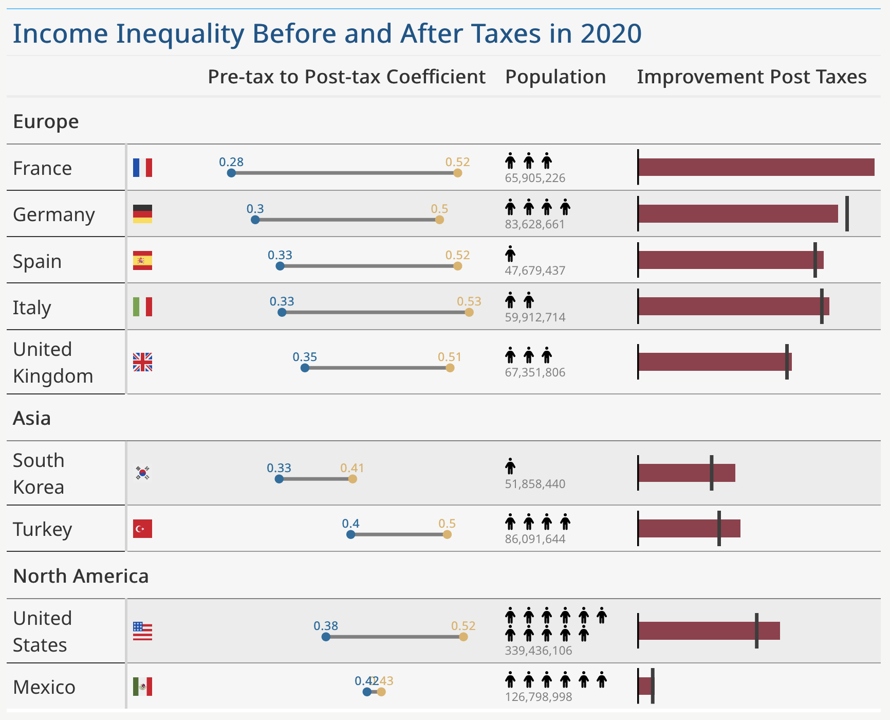
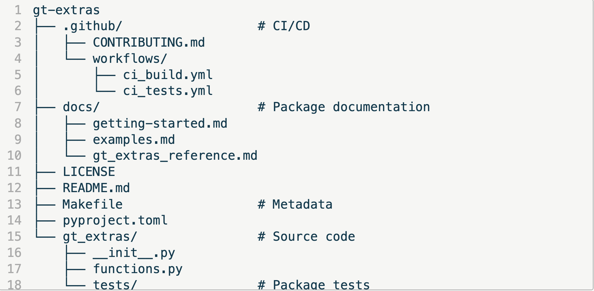

<!-- todo: background color trick on all tables -->

<!-- todo: try to animate? 
https://quarto.org/docs/presentations/revealjs/advanced.html#code-animations -->

<!--
NOTE FOR AGENTS: Do not add speaker notes to this file. 
Jules will add speaker notes later.
-->

<!-- 
Images:
bike_drivetrain: Photo by Mathias Reding: https://www.pexels.com/photo/close-up-photo-of-bicycle-gears-13415392/
bike_tail_light: Photo by chatchawarn loetsupan: https://www.pexels.com/photo/close-up-of-a-back-light-on-a-bicycle-10744841/
bike_bell: Photo by Nick Duell: https://www.pexels.com/photo/brass-bicycle-bell-107510/
bike_with_basket: Photo by Martii Tolentino: https://www.pexels.com/photo/man-and-woman-riding-bicycle-on-crosswalk-18529803/
generic_bike: Photo by Pixabay: https://www.pexels.com/photo/black-fixed-gear-bike-beside-wall-276517/ (or my bike)
wireless_mouse: Photo by Gül Işık: https://www.pexels.com/photo/black-wireless-mouse-beside-laptop-2272759/
lunch_and_fork: Photo by Jacob  Yavin: https://www.pexels.com/photo/snack-meal-inside-a-lunch-box-12861383/
bike_backpack: Photo by ronyescobarhn  : https://www.pexels.com/photo/cyclist-enjoying-sunny-beach-boulevard-ride-34975805/
two_bikes: Photo by Jan van der Wolf: https://www.pexels.com/photo/red-electric-bicycles-in-a-scenic-outdoor-setting-30179590/
saddle_bags: Photo by Pack2Ride: https://www.pexels.com/photo/a-bicycle-on-the-road-8934535/
stick_figures: Photo by Tara Winstead: https://www.pexels.com/photo/an-illustration-of-stick-people-8378752/
-->

### About Me

- Author of **gt-extras**
- Great Tables at Posit: Michael Chow and Richard Iannone
- I enjoy 🏓, ⚽, 🧗, 🚴

# Biking

## Roommate Story
:::: {.r-stack}

::: {.fragment fragment-index=1 .fade-in-then-out}

{width=9in}

:::


::: {.fragment fragment-index=2}

{width=9in}

:::

::::

::: {.footer}

Photos by Tara Winstead: https://www.pexels.com/photo/an-illustration-of-stick-people-8378752/

and Pixabay: https://www.pexels.com/photo/black-fixed-gear-bike-beside-wall-276517/

:::

---

## Maintenance, Upgrades

::::: {.columns}

:::: {.column width="3.965in"}

::: {.fragment fragment-index=1}


:::

::::

:::: {.column}

::: {.fragment fragment-index=2}

{width=3.8in}

:::

::: {.fragment fragment-index=3}

{width=3.8in}

:::

::::

:::::

::: {.footer}
Photos by chatchawarn loetsupan: https://www.pexels.com/photo/close-up-of-a-back-light-on-a-bicycle-10744841/

Nick Duell: https://www.pexels.com/photo/brass-bicycle-bell-107510/

and Mathias Reding: https://www.pexels.com/photo/close-up-photo-of-bicycle-gears-13415392/
:::

---

## You Borrow It

::::: {.columns}

:::: {.column}

::: {.fragment fragment-index=1}


:::

::::

:::: {.column width="46.9%"}

::: {.fragment fragment-index=2}


:::

::::

:::::

::: {.footer}
Photos by Gül Işık: https://www.pexels.com/photo/black-wireless-mouse-beside-laptop-2272759/

and Jacob Yavin: https://www.pexels.com/photo/snack-meal-inside-a-lunch-box-12861383/
:::

---

## Solve It For Yourself

::: {.fragment fragment-index=1}

{width=9in}

:::

::: {.footer}
Photo by ronyescobarhn: https://www.pexels.com/photo/cyclist-enjoying-sunny-beach-boulevard-ride-34975805/ 
:::

---

## Modify The Bike For Everyone

::: {.fragment fragment-index=1}

{width=9in}

:::

::: {.footer}
Photo by Martii Tolentino: https://www.pexels.com/photo/man-and-woman-riding-bicycle-on-crosswalk-18529803/
:::

---

## Fork The Bike

::: {.fragment fragment-index=1}

{width=9in}

:::

::: {.footer}
Photo by Jan van der Wolf: https://www.pexels.com/photo/red-electric-bicycles-in-a-scenic-outdoor-setting-30179590/
:::

---

## Use An Optional Attachment

::: {.fragment fragment-index=1}

{width=9in}

:::

::: {.footer} 
Photo by Pack2Ride: https://www.pexels.com/photo/a-bicycle-on-the-road-8934535/
:::

# Developing Packages

## Programming story

::::: {.r-stack}

::: {.fragment fragment-index=1 .fade-in-then-out}

{width=9in}

:::

:::: {layout-nrow="2"}

::: {.fragment fragment-index=2}

{width=3in height=0.5in style="margin-bottom: 0em !important;"}

:::

::: {.fragment fragment-index=3}

{width=9in}

:::

::::

:::::

::: {.notes}
Your roommates developed a package, (Michael and Richard)
:::

---

## Maintenance, Upgrades

::: {.fragment fragment-index=1}

{width=10in}

:::

---

## You Borrow It

::: {.panel-tabset style="zoom: 90%; font-size: 36px;"}

## The Dataset

```{python}
import polars as pl

pre_tax_col = "gini_market__age_total"
post_tax_col = "gini_disposable__age_total"

df = pl.read_csv("./assets/income_inequality.csv")

df
```

## Great Table

```{python}
from great_tables import GT, html
import gt_extras as gte

df_with_icons = df.with_columns(
    pl.col("pop_icons").map_elements(
        lambda x: gte.fa_icon_repeat(name="person", repeats=int(x)),
        return_dtype=pl.String,
    )
)

# Generate the table, before gt-extras add-ons
gt = (
    GT(df_with_icons, rowname_col="Entity", groupname_col="owid_region")
    .tab_header(
        "Income Inequality Before and After Taxes in 2020",
    )
    .cols_move("pop_icons", after=pre_tax_col)
    .cols_align("left")
    .cols_hide(["Year", "pop_log", "population_historical"])
    .fmt_flag("Code")
    .cols_label(
        {
            "Code": "",
            "gini_pct_change": "Improvement Post Taxes",
            "pop_icons": "Population",
        }
    )
    .with_id("gini-table")
)

gt
```

## Your Great(er) Table

```{python}
import gt_extras as gte

gt_extra = gt.pipe(
    gte.gt_plt_dumbbell,
    col1=pre_tax_col,
    col2=post_tax_col,
    col1_color="#e0b165",
    col2_color="#106ea0",
    dot_border_color="transparent",
    num_decimals=2,
    width=240,
    label="Pre-tax to Post-tax Coefficient",
).pipe(
    gte.gt_plt_bullet,
    "gini_pct_change",
    "gini_pct_benchmark_5yr",
    fill="#963d4c",
    target_color="#3D3D3D",
    bar_height=15,
    width=200,
).pipe(
    gte.gt_merge_stack,
    col1="pop_icons",
    col2="population_historical",
).pipe(gte.gt_theme_guardian)

gt_extra
```

:::

---

## Solve It For Yourself

### Write It Locally

:::: {.r-stack}

::: {.fragment fragment-index=1 .fade-in-then-out}

{width=10in}

:::

::: {.fragment fragment-index=2}


{width=9in}

:::

::::

<!-- Build it in your notebook, in your scripts, in your project code.

Pros/cons
It works for you. But it breaks for your colleague. It doesn't scale. -->

---

## ~~Modify The Bike~~ For Everyone

### *Submit a PR* For Everyone

::: {.fragment fragment-index=1}

{width=5.75in}

:::


<!-- 3 Hope it get's built in to the library

pros/cons
Submit your feature request, your code review, hope they say yes. Six months later, maybe they do, Maybe they don't. -->

---

## Fork The ~~Bike~~

### Fork the *Package*

::: {.fragment fragment-index=1}

{width=8in}

:::

<!-- Fork the repo
pros/cons 
maintaining a shadow version of a library you didn't write, forever watching for updates you have to manually merge. -->

::: {.footer}
Photo by Lukas: https://www.pexels.com/photo/turned-on-laptop-computer-574073/
:::

---

## ~~Use An Optional Attachment~~

### *Build A Companion Package*

* **gt-extras** + `great_tables`
* **nbmail** or **red-mail** + `smtplib`
* **requests-toolbelt** + `requests`

<!-- For the above examples doing each solution -->

<!-- describe what the option is, with an image-->

<!-- list out some advantages and painful aspects of the solution  -->


# What Goes In The Package


## What's In A Package?

{width=3.5in fig-align="left" style="margin-bottom:0px;"}

:::: {.columns}

::: {.column width=50%}

1. 17th gear
2. Mountain Ride
3. Folding Bike

:::

::: {.column width=50%}

1. Wrapping
2. Composing
3. Extending

:::

::::

---

## 1) Wrapping

::: {.two-column-code}

```{python}
# | echo: true
# | output-location: column
from great_tables import GT, html
from great_tables.data import airquality

airquality_mini = airquality.head(10).assign(Year=1973)

gt = (
    GT(airquality_mini)
    .tab_header(
        title="New York Air Quality Measurements",
        subtitle="Daily measurements in New York City (May 1-10, 1973)"
    )
    .tab_spanner(label="Time", columns=["Year", "Month", "Day"])
    .tab_spanner(
        label="Measurement",
        columns=["Ozone", "Solar_R", "Wind", "Temp"],
    )
    .cols_move_to_start(columns=["Year", "Month", "Day"])
    .cols_label(
        Ozone=html("Ozone,<br>ppbV"),
        Solar_R=html("Solar R.,<br>cal/m<sup>2</sup>"),
        Wind=html("Wind,<br>mph"),
        Temp=html("Temp,<br>&deg;F"),
    )
)

gt
```

:::

---

## 1) Wrapping

:::: {layout-ncol="2"}

::: {.placeholder-class}

```{python}
gt
```

:::

:::  {.fragment fragment-index=1}

```{python}
from great_tables import loc, style

columns = ["Wind"]

locations = [
    loc.body(columns=columns),
    loc.column_labels(columns=columns),
]

# Make the wrapped tab_style call
gt_highlighted = gt.tab_style(
    style=style.fill(color="lightblue"),
    locations=locations,
)

gt_highlighted
```

:::

::::

---

## 1) Wrapping

:::: {.columns}

::: {.column width=50%}

```{python}
gt_highlighted
```

:::

::: {.column}

:::::: {.r-stack}

::::: {.fragment fragment-index=1 .fade-in-then-out style="font-size:75%; padding-top:10px; position:absolute;"}

```{python}
# | echo: true
# | output: false
from great_tables import loc, style

locations = [
    loc.body(columns="Wind"),
    loc.column_labels(columns="Wind"),
]

# Make the wrapped tab_style call
gt.tab_style(
    style=style.fill(color="lightblue"),
    locations=locations,
)
```

:::::

::::: {.fragment fragment-index=2 style="font-size:75%; padding-top:10px;"}

```{python}
# | echo: true
# | output: false
# | code-line-numbers: "|4-13|"
from great_tables import GT, loc, style

def highlight_columns(gt: GT, columns) -> GT:
    locations = [
        loc.body(columns=columns),
        loc.column_labels(columns=columns),
    ]

    # Make the wrapped tab_style call
    return gt.tab_style(
        style=style.fill(color="lightblue"),
        locations=locations,
    )

highlight_columns(gt, columns="Wind")
```

:::::


::::::

:::

::::


<!-- first composing slide -->

## 2) Composing

::: {.two-column-code}

```{python}
# | echo: true
# | output-location: column
from great_tables import GT, html
from great_tables.data import airquality

airquality_mini = airquality.head(10).assign(Year=1973)

gt = (
    GT(airquality_mini)
    .tab_header(
        title="New York Air Quality Measurements",
        subtitle="Daily measurements in New York City (May 1-10, 1973)"
    )
    .tab_spanner(label="Time", columns=["Year", "Month", "Day"])
    .tab_spanner(
        label="Measurement",
        columns=["Ozone", "Solar_R", "Wind", "Temp"],
    )
    .cols_move_to_start(columns=["Year", "Month", "Day"])
    .cols_label(
        Ozone=html("Ozone,<br>ppbV"),
        Solar_R=html("Solar R.,<br>cal/m<sup>2</sup>"),
        Wind=html("Wind,<br>mph"),
        Temp=html("Temp,<br>&deg;F"),
    )
)

gt
```

:::

---

## 2) Composing

:::: {layout-ncol="2"}

::: {.placeholder-class}

```{python}
gt
```

:::

:::  {.fragment fragment-index=1}

```{python}
def some_theme(gt: GT) -> GT:
    return (
        gt
        .opt_row_striping()
        .opt_table_font(font="Courier")
        .tab_options(
            heading_align="left",
            column_labels_text_transform="lowercase",
            row_striping_background_color="#b5dbb6",
        )
    )

gt.pipe(some_theme)
```

:::

::::

---

## 2) Composing

:::: {.columns}

::: {.column width=40%}

```{python}
gt.pipe(some_theme)
```

:::

::: {.column .fragment fragment-index=1 style="font-size:75%; padding-top:10px; width:60%;"}

```{python}
# | echo: true
# | output: false
# | code-line-numbers: "|3-10|1-2,11"
def some_theme(gt: GT) -> GT:
    return (
        gt
        .opt_row_striping()
        .opt_table_font(font="Courier")
        .tab_options(
            heading_align="left",
            column_labels_text_transform="lowercase",
            row_striping_background_color="#b5dbb6",
        )
    )

gt.pipe(some_theme)
```

:::

::::

<!-- first extending slide -->

## 3) Extending

::: {.two-column-code}

```{python}
# | echo: true
# | output-location: column
from great_tables import GT, html
from great_tables.data import airquality

airquality_mini = airquality.head(10).assign(Year=1973)

gt = (
    GT(airquality_mini)
    .tab_header(
        title="New York Air Quality Measurements",
        subtitle="Daily measurements in New York City (May 1-10, 1973)"
    )
    .tab_spanner(label="Time", columns=["Year", "Month", "Day"])
    .tab_spanner(
        label="Measurement",
        columns=["Ozone", "Solar_R", "Wind", "Temp"],
    )
    .cols_move_to_start(columns=["Year", "Month", "Day"])
    .cols_label(
        Ozone=html("Ozone,<br>ppbV"),
        Solar_R=html("Solar R.,<br>cal/m<sup>2</sup>"),
        Wind=html("Wind,<br>mph"),
        Temp=html("Temp,<br>&deg;F"),
    )
)

gt
```

:::

---

## 3) Extending

:::: {layout-ncol="2"}

::: {.placeholder-class}

```{python}
gt
```

:::

:::  {.fragment fragment-index=1}

<!-- todo: revisit this, the build step should be seperate in the slides -->

```{python}
def fmt_threshold(gt, columns, threshold: float):

    def _truncate(val: float):
        if val < threshold:
            return f"<{threshold}"
        else:
            return str(val)

    return gt.fmt(_truncate, columns)

gt.pipe(fmt_threshold, "Wind", 10.0).pipe(highlight_columns, "Wind")

```

:::

::::

---

## 3) Extending

:::: {.columns}

::: {.column width=40%}

```{python}
gt.pipe(fmt_threshold, "Wind", 10.0).pipe(highlight_columns, "Wind")
```

:::

::: {.column .fragment fragment-index=1 style="font-size:75%; padding-top:10px; width:60%;"}

```{python}
# | echo: true
# | output: false
# | code-line-numbers: "|3-7|1-9"
def fmt_threshold(gt, columns, threshold: float):

    def _truncate(val: float):
        if val < threshold:
            return f"<{threshold}"
        else:
            return str(val)

    return gt.fmt(_truncate, columns)

gt.pipe(fmt_threshold, "Wind", 10.0)
```

:::

::::

# Finishing the Package

## Package Structure {auto-animate="true"}

#### Metadata and source code

```{text}
gt-extras
├── pyproject.toml            # Metadata
└── gt_extras/                # Source code
    ├── __init__.py
    └── functions.py
```

## Package Structure {auto-animate="true"}

#### Tests


```{text}
gt-extras
├── pyproject.toml            # Metadata
└── gt_extras/                # Source code
    ├── __init__.py
    ├── functions.py
    └── tests/                # Package tests
```

## Package Structure {auto-animate="true"}

#### Documentation

```{text}
gt-extras
├── docs/                     # Package documentation
│   ├── getting-started.md
│   ├── examples.md
│   └── gt_extras_reference.md
├── LICENSE
├── README.md
├── Makefile                  # Metadata
├── pyproject.toml
└── gt_extras/                # Source code
    ├── __init__.py
    ├── functions.py
    └── tests/                # Package tests
```

## Package Structure {auto-animate="true"}

#### Continuous Integration / Continuous Development

```{text}
gt-extras
├── .github/                  # CI/CD
│   ├── CONTRIBUTING.md
│   └── workflows/
│       ├── ci_build.yml
│       └── ci_tests.yml
├── docs/                     # Package documentation
│   ├── getting-started.md
│   ├── examples.md
│   └── gt_extras_reference.md
├── LICENSE
├── README.md
├── Makefile                  # Metadata
├── pyproject.toml
└── gt_extras/                # Source code
    ├── __init__.py
    ├── functions.py
    └── tests/                # Package tests
```

---

## Tests {auto-animate="true"}

#### Using `pytest`

```{python filename="test_highlight.py"}
# | echo: true
# | output: false
# | eval: false
import pytest
from great_tables import GT
from gt_extras import highlight_columns
```

## Tests {auto-animate="true"}

#### Snapshot test

```{python filename="test_highlight.py"}
# | echo: true
# | output: false
# | eval: false
import pytest
from great_tables import GT
from gt_extras import highlight_columns

   
def test_highlight_columns_snap(snapshot, mini_gt):
    res = highlight_columns(mini_gt)
    assert_rendered_body(snapshot, gt=res)
```

## Tests {auto-animate="true"}

#### Check content directly

```{python filename="test_highlight.py"}
# | echo: true
# | output: false
# | eval: false
import pytest
from great_tables import GT
from gt_extras import highlight_columns

   
def test_highlight_columns_snap(snapshot, mini_gt):
    res = highlight_columns(mini_gt)
    assert_rendered_body(snapshot, gt=res)


def test_highlight_columns(mini_gt):
    gt = highlight_columns(mini_gt, columns=[1, 2])
    html = gt.as_raw_html()
    assert html.count("lightblue") == num_rows(mini_gt) * 2
```

---

## Documentation {auto-animate="true"}

#### Docstring

```{python}
# | eval: false
# | echo: true
# | output: false
def highlight_columns(gt: GT, columns) -> GT:
    """
    Add color highlighting to one or more specific columns.

    Parameters
    ----------
    gt
        An existing `GT` object.

    columns
        The columns to target. Can be a single column or a list of columns (by name or index).
        If `None`, the coloring is applied to all columns.
```

## Documentation {auto-animate="true"}

#### Return value

```{python}
# | eval: false
# | echo: true
# | output: false
def highlight_columns(gt: GT, columns) -> GT:
    """
    Add color highlighting to one or more specific columns.

    Parameters
    ----------
    gt
        An existing `GT` object.

    columns
        The columns to target. Can be a single column or a list of columns (by name or index).
        If `None`, the coloring is applied to all columns.

    Returns
    -------
    GT
        The `GT` object is returned.
```

## Documentation {auto-animate="true"}

#### Example

```{python}
# | eval: false
# | echo: true
# | output: false
    """
    Parameters
    ----------
    gt
        An existing `GT` object.

    columns
        The columns to target. Can be a single column or a list of columns (by name or index).
        If `None`, the coloring is applied to all columns.

    Returns
    -------
    GT
        The `GT` object is returned.

    Example
    --------
    gt.pipe(gte.highlight_columns, columns="hp")
    """
```

---

## CI/CD {auto-animate="true"}

#### Continuous Integration / Continuous Development

`.github/workflows/*.yml`

## CI/CD {auto-animate="true"}

#### When to run it

```{yaml}
name: Tests

on: [push, pull_request, release]
```

## CI/CD {auto-animate="true"}

#### Write a job


```{yaml}
name: Tests

on: [push, pull_request, release]

jobs:
  test:
    runs-on: ubuntu-latest
    strategy:
      matrix:
        python-version: ['3.9', '3.12']
    steps:
      - name: Checkout
      - name: Install uv
      - name: "Set up Python"
      - name: Install the project
      - name: Test
```

## CI/CD {auto-animate="true"}

#### Execute each step

```{yaml}
jobs:
  test:
    runs-on: ubuntu-latest
    steps:
      - name: Checkout
        uses: actions/checkout@v4
      - name: Install uv
        uses: astral-sh/setup-uv@v5
      - name: "Set up Python"
        uses: actions/setup-python@v5
        with:
          python-version: ${{ matrix.python-version }}
      - name: Install the project
        run: uv sync --all-extras --dev
      - name: Test
        run: |
          uv run pytest
```

---

## Configuration {auto-animate="true"}

#### `pyproject.toml`

```{text}
[project]
name = "gt-extras"
version = "0.1.0"
description = "Provides additional functions for creating beautiful tables with 'great-tables'."
```


## Configuration {auto-animate="true"}

#### Requirements

```{text}
[project]
name = "gt-extras"
version = "0.1.0"
description = "Provides additional functions for creating beautiful tables with 'great-tables'."
requires-python = ">=3.9"
dependencies = [
    "great-tables>=0.18.0",
    "svg-py>=1.6.0",
]
```

## Configuration {auto-animate="true"}

#### Other metadata

```{text}
[project]
name = "gt-extras"
version = "0.1.0"
description = "Provides additional functions for creating beautiful tables with 'great-tables'."
requires-python = ">=3.9"
dependencies = [
    "great-tables>=0.18.0",
    "svg-py>=1.6.0",
]

[tool.pytest.ini_options]
minversion = "6.0"
addopts = "-ra --cov=gt_extras --cov-report=term-missing"
testpaths = ["gt_extras/tests"]

keywords = ["tables", "html"]
```

---

## We Talked About {auto-animate="true"}

::: {layout="[[1]]"}
{width=9in data-id="img1"}
:::

::: {.notes}
- Bicycle bags!
:::

---

## We Talked About {auto-animate="true"}

::: {layout="[[30,70]]"}

{width=3in data-id="img1"}

{width=7in data-id="img2"}
:::

::: {.notes}
- Bicycle bags!
- Why to write a companion package
:::

---

## We Talked About {auto-animate="true"}

::: {layout="[[1, 1], [1]]"}

{width=3in data-id="img1"}

{width=2.6in data-id="img2"}

{width=4in data-id="img3"}

:::

::: {.notes}
- Bicycle bags!
- Why to write a companion package
- How to write a companion package
:::

---

## We Talked About {auto-animate="true"}

::: {layout="[[1, 1], [1, 1]]"}

{width=3in data-id="img1"}

{width=2.6in data-id="img2"}

{width=3in data-id="img3"}

{width=5.5in data-id="img4"}
:::

::: {.notes}
- Bicycle bags!
- Why to write a companion package
- How to write a companion package
- How to build a companion package
:::

---

## Thank You

::: {.fragment fragment-index=1}
to Michael Chow and Richard Ianonne (and the Posit family)
:::

:::::: {.fragment fragment-index=2}

::::: {.columns}

::: {.column width="60%"}

- [Great Tables](https://posit-dev.github.io/great-tables/)

- [gt-extras](https://posit-dev.github.io/gt-extras/)

:::

::: {.column width="40%"}


:::

::::

:::::


::: footer
Find these slides at [juleswg.me](https://juleswg.me)
:::